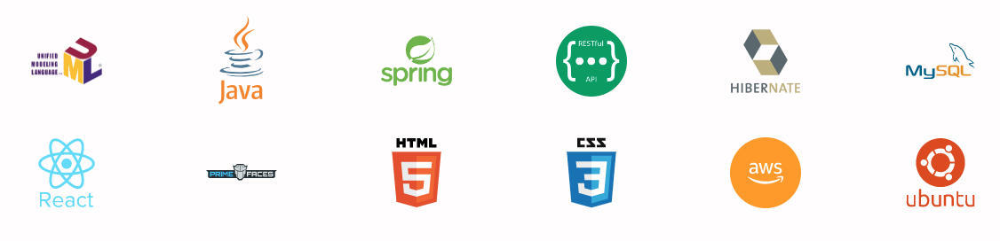
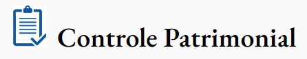
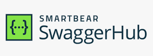
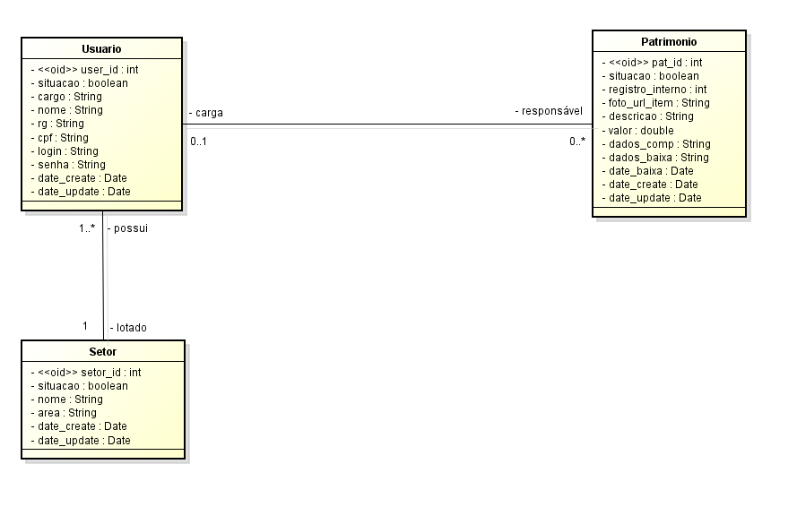

# Projeto Full Stack Patrimônio
Um projeto amostra para apresentar tecnologias e modelagem de dados

## Desenvolvimento do Front-End:
A tecnologia utilizada pelo front_end para consumir a API foi a biblioteca React. Esta SPA, single-page application, tem em sua estrutura o JavaScript com a apresentação de dados através do HTML 5 e sua estilização pelo CSS 3. A biblioteca de componentes do Prime Faces auxíliou para apresentação as listas de dados de forma fácil é agradável. Um bucket criado pelo S3 da AWS dispõe este aplicação. A codificação da API pode ser também acompanhada através deste link:

### Front-End - Consumo da API com base no React, link de acesso:

### Back-End - API Restful com base no Spring Boot 3.0, link de acesso:

### A regra de negócio
A necessidade de controle patrimonial de uma empresa, ou entidade privada, se faz necessário como um módulo administrativo que interage seus dados com outros módulos, como o controle de funcionários e a contabilidade. 
A entrada de um bem é feita por um código único que elencará os dados do item como sua carga patrimonial e a quem pertence este item.
Futuros relatórios ou balanços podem ser gerados com estas informações salvas em um base de dados.

### Modelo Concentual

### Diagrama de Objetos

